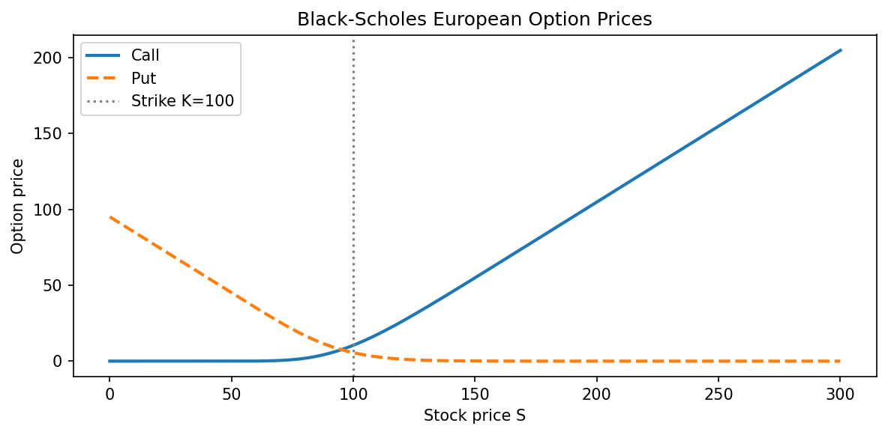
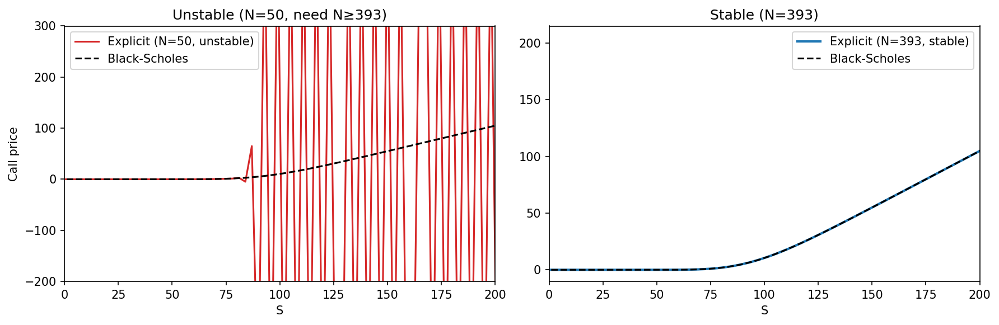
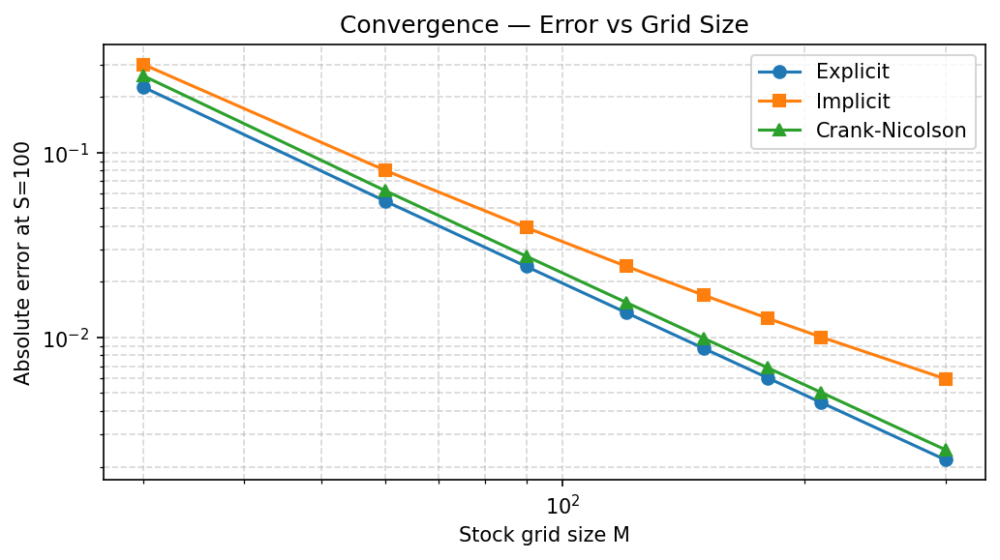
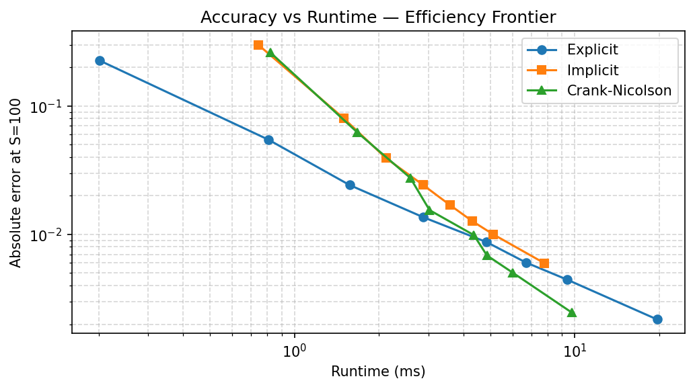
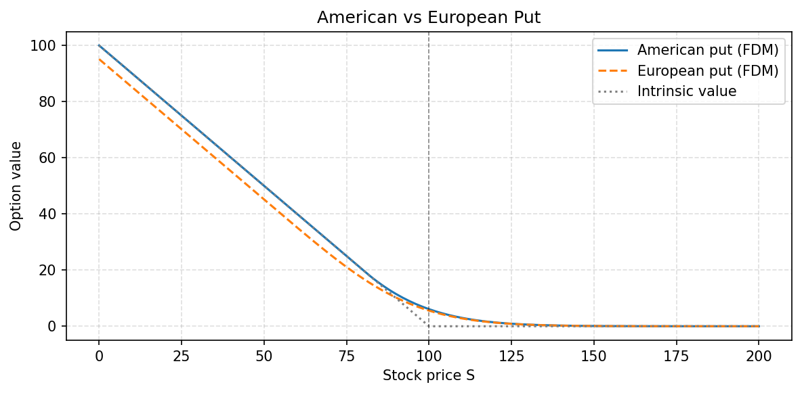

# Finite Difference Methods for Option Pricing

Solves the Black-Scholes PDE numerically using finite difference methods (FDM), then validates against closed-form prices and benchmarks accuracy, runtime, and convergence across three schemes.

---

## Background

The Black-Scholes PDE for a European option is:

```
∂V/∂t + ½σ²S²∂²V/∂S² + rS∂V/∂S - rV = 0
```

While this has a closed-form solution for European options, most real-world extensions (American exercise, barriers, local vol) do not. Finite difference methods discretize the PDE on a grid and solve it numerically, making them the workhorse of practical derivatives pricing.

The idea is to build a 2D grid of stock prices S and times t, fill in the terminal condition (the option payoff at expiry), then step backward in time to t=0 — where the option price today sits.

---

## Methods

| Method | Stability | Time accuracy | Notes |
|---|---|---|---|
| Explicit | Conditional | O(dt) | No linear solve; requires small time steps |
| Implicit | Unconditional | O(dt) | One tridiagonal solve per step |
| Crank-Nicolson | Unconditional | O(dt²) | Same cost as implicit; more accurate |
| American (CN) | Unconditional | O(dt²) | CN + early exercise constraint |

The three schemes differ in *when* they evaluate the spatial derivatives. The explicit scheme uses only the known previous time level — no solve required, but the time step must be tiny or errors explode. The implicit scheme evaluates at the new (unknown) time level, which requires solving a tridiagonal system at each step but is unconditionally stable. Crank-Nicolson splits the difference 50/50, getting second-order accuracy in time at the same per-step cost as implicit.

---

## Project Structure

```
finite-difference/
├── src/
│   ├── core.py                    # Grid, payoff, boundary conditions, Black-Scholes formula
│   └── solvers/
│       ├── explicit.py            # Explicit scheme + stability limit
│       ├── implicit.py            # Fully implicit scheme
│       ├── crank_nicolson.py      # Crank-Nicolson scheme
│       └── american.py            # American options (CN + early exercise) + binomial benchmark
├── notebooks/
│   ├── 01_black_scholes_formula.ipynb
│   ├── 02_grid_and_boundary_conditions.ipynb
│   ├── 03_european_implicit.ipynb
│   ├── 04_european_crank_nicolson.ipynb
│   ├── 05_european_explicit.ipynb
│   ├── 06_accuracy_runtime_comparison.ipynb
│   └── 07_american_put.ipynb
└── results/
```

---

## Results

Parameters used throughout: `K=100, r=0.05, sigma=0.20, T=1.0, S0=100`.

---

### Black-Scholes reference

The closed-form solution serves as ground truth for all FDM validation. A few things to notice in the plot: both curves are worth zero deep out-of-the-money, the call grows without bound as S increases (it behaves like the stock for large S), and the two curves are related by put-call parity.



---

### Explicit method — conditional stability

The explicit scheme is the simplest to implement but comes with a hard constraint on the time step:

```
dt ≤ 1 / (σ²(M-1)² + r)
```

This comes from requiring all weights in the update formula to be non-negative (otherwise errors amplify each step). The constraint tightens quadratically as the stock grid is refined — doubling M forces roughly 4× more time steps, making the scheme expensive at high resolution.

The plot below shows what happens when you ignore the constraint (N=50, left) versus respecting it (N=393, right):



The unstable solution oscillates wildly and bears no resemblance to a call price. This is a practical reminder that a numerically cheap scheme is only cheap if it gives correct answers.

---

### Convergence and runtime

All three methods converge to the true Black-Scholes price as the grid is refined, but at different rates and costs.



**What the slope tells you:** on a log-log plot, a slope of -1 means halving the error costs 2× more grid points (first-order convergence). A slope of -2 means it costs only √2× more points for the same error reduction (second-order). Crank-Nicolson's steeper slope reflects its O(dt²) time accuracy — it gets more accurate faster as the grid grows.

**Why implicit sometimes beats CN at coarse grids:** the call payoff has a kink at S=K that excites small oscillations in Crank-Nicolson. The fully-implicit scheme damps these naturally. The oscillations disappear as the grid is refined, which is when CN pulls ahead.

The efficiency frontier shows the most practically useful comparison — for a given compute budget, which method gives the lowest error?



**Key takeaway:** Crank-Nicolson dominates at fine grids. Explicit is never on the frontier — it spends too much time on stability overhead. Implicit is competitive at coarse grids where CN's oscillation issue hasn't fully resolved yet. For any serious pricing application, Crank-Nicolson is the right default.

| Method | M=300 error | M=300 time (ms) |
|---|---|---|
| Explicit | 0.002178 | 13.06 |
| Implicit | 0.005971 | 5.96 |
| Crank-Nicolson | 0.002468 | 6.70 |

CN matches explicit's accuracy at less than half the runtime.

---

### American options

American options can be exercised at any time before expiry, which means the holder will always do at least as well as exercising immediately. This gives the constraint:

```
V(S, t) ≥ max(K - S, 0)   for all S, t
```

This is the **free-boundary condition** — there is an unknown boundary S*(t) below which early exercise is optimal, and the solver has to find it implicitly. The implementation is surprisingly simple: run Crank-Nicolson as usual, then after each backward step enforce `V = max(V, intrinsic_value)`. One extra line of code unlocks the American problem.



**What the gap represents:** the American put is worth strictly more than the European put for low stock prices. Deep in-the-money, the European put's value actually dips *below* the intrinsic value (the dotted line) — you'd be better off exercising now and collecting K-S in cash, but the European contract won't let you. The American contract closes this gap by guaranteeing the holder can always recover at least intrinsic value.

**Validated against a binomial tree:** the FDM price (M=N=300) agrees with a CRR binomial tree (N=1000) to within ~0.001, confirming the early exercise constraint is being applied correctly.

---

## Quick Start

```python
from src.solvers.crank_nicolson import solve_crank_nicolson
from src.core import bs_price
import numpy as np

S_max, K, r, sigma, T = 300, 100, 0.05, 0.20, 1.0
M, N = 300, 300

S, V = solve_crank_nicolson(S_max, K, r, sigma, T, M, N, option_type='call')
fdm_price = float(np.interp(100.0, S, V))
exact     = bs_price(100.0, K, T, r, sigma, option_type='call')

print(f'FDM:   {fdm_price:.4f}')
print(f'Exact: {exact:.4f}')
print(f'Error: {abs(fdm_price - exact):.6f}')
```

```python
from src.solvers.american import solve_american, binomial_american
import numpy as np

S, V = solve_american(S_max, K, r, sigma, T, M=300, N=300, option_type='put')
amer_price = float(np.interp(100.0, S, V))
bin_price  = binomial_american(100.0, K, r, sigma, T, N=1000, option_type='put')

print(f'American put (FDM):      {amer_price:.4f}')
print(f'American put (binomial): {bin_price:.4f}')
```

## Dependencies

```
numpy
scipy
matplotlib
jupyter
```
